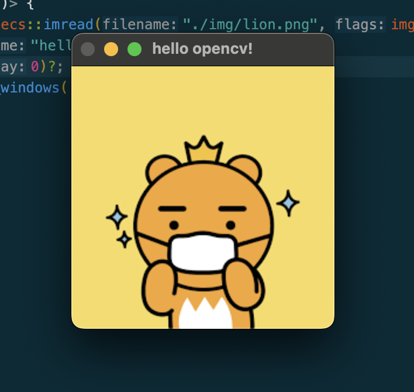

> 백준 알고리즘

# Rust에서 OpenCV 를 사용하기

Opencv사용하기


- OpenCV(Open Source Computer Vision Library)는 실시간 컴퓨터 비전을 목적으로 한 인텔이 개발한 라이브러리입니다. C++, Python, Java, MATLAB 등에서 사용할 수 있으며, 실시간 이미지 프로세싱에 널리 사용됩니다. 이 라이브러리는 머신러닝 및 딥러닝 알고리즘을 구현하고 컴퓨터 비전 애플리케이션을 개발하기 위한 풍부한 툴 세트를 제공합니다. OpenCV는 컴퓨터 비전에 대한 다양한 작업을 수행할 수 있도록 해주는 강력하고 유연한 라이브러리입니다.
## 주요기능


- 영상 처리 (Image Processing): 회전, 크기 조정, 필터링, 선 검출 등과 같은 영상 처리 기술을 제공합니다.
- 객체 탐지 (Object Detection): Haar 기반의 객체 탐지, 특징 추출, 객체 추적, 인식 및 분할 기능을 제공합니다.
- 기계 학습 (Machine Learning): SVM(Support Vector Machine), k-NN(k-Nearest Neighbors), 결정 트리(Decision Trees) 등과 같은 기계 학습 알고리즘을 구현합니다.
- 딥러닝 (Deep Learning): 딥러닝 프레임워크와 통합하여 사용할 수 있습니다.
- 카메라 캡처 (Camera Capture): 카메라에서 영상을 실시간으로 캡처할 수 있습니다.
- 영상 출력 (Image Display): 생성한 영상을 화면에 출력할 수 있습니다.

## 설치

- m1기준 먼저 HomeBrew를 설치해줍니다.
```
/bin/bash -c "$(curl -fsSL https://raw.githubusercontent.com/Homebrew/install/HEAD/install.sh)"
```
- 그다음 Brew를 이용하여 openCV에 필요한 라이브러리들을 install해줍니다.
```
brew install pkg-config
brew install cmake
brew install --debug llvm-dev
brew install libopencv-dev
```
- 그다음 Opencv를 RUst에서 사용하기 위해서는 환경설정을 먼저 해주어야 합니다.

```
vi ~/.zshrc
```
```
export PATH="/opt/homebrew/opt/llvm/bin:$PATH"
export LDFLAGS="-L/opt/homebrew/opt/llvm/lib"
export CPPFLAGS="-I/opt/homebrew/opt/llvm/include"
export PATH="/usr/local/opt/llvm/bin:$PATH"

```
- Rust에서 사용하기 위해서는 Cargo.toml에 추가를 해주어야 합니다.
```
opencv = "0.90.0"
```

- 본격적으로 Rust에서 OpenCV를 실행해보겟습니다.
- 먼저 Rust애서 Opencv를 사용하기 앞서 중요한 모듈들이 있습니다.
- core,highgui,imgproc,imgcodecs입니다.
## 1.core
- core 모듈은 OpenCV의 기본적인 기능을 제공합니다. 다음은 core 모듈의 몇 가지 중요한 기능입니다.

Mat (행렬): Mat은 OpenCV에서 이미지나 행렬을 나타내는 가장 일반적인 구조체입니다. Mat은 행렬, 이미지, 다차원 배열 등을 포함할 수 있습니다.
Point (점), Rect (사각형), Size (크기): 기하학적 개체를 정의하기 위한 구조체입니다.
Scalar (색상 값): 색상 값을 나타냅니다. 보통 (Blue, Green, Red) 또는 (Hue, Saturation, Value) 형식으로 나타내어지며, 각 값은 0에서 255까지의 범위를 가집니다.
## 2.core
- highgui 모듈은 그래픽 사용자 인터페이스와 관련된 함수들을 제공합니다. 다음은 highgui 모듈의 주요 기능입니다.

Mat (행렬): Mat은 OpenCV에서 이미지나 행렬을 나타내는 가장 일반적인 구조체입니다. Mat은 행렬, 이미지, 다차원 배열 등을 포함할 수 있습니다.
Point (점), Rect (사각형), Size (크기): 기하학적 개체를 정의하기 위한 구조체입니다.
Scalar (색상 값): 색상 값을 나타냅니다. 보통 (Blue, Green, Red) 또는 (Hue, Saturation, Value) 형식으로 나타내어지며, 각 값은 0에서 255까지의 범위를 가집니다.
## 3.core
- imgproc 모듈은 이미지 처리 함수를 제공합니다. 다음은 imgproc 모듈의 주요 기능입니다.


cvt_color: 이미지의 색상을 변환합니다.
resize: 이미지의 크기를 조절합니다.
GaussianBlur: 이미지에 가우시안 블러를 적용합니다.
canny: Canny Edge Detection을 수행합니다.
## 4.core
- imgcodecs 모듈은 이미지를 디스크에 쓰거나 디스크에서 읽는 함수를 제공합니다. 다음은 imgcodecs 모듈의 주요 기능입니다.

imread: 이미지를 읽어옵니다.
imwrite: 이미지를 저장합니다.

- 이제 이것을 토대로 이미지를 불러와서 보여주는 예제를 작성해보겟습니다..
- 우선 필요한 모듈들을 불러와줍니다.
```rs
   use opencv::{Result,core,highgui,imgcodecs,imgproc};

```
- 이미지를 불러옵니다.imgcodecs에 imread라는 함수를 실행시켜 이미지를 불러올수 있습니다.오른쪽 flag에는 IMREAD_COLOR라는 flag를 불러옵니다.IMREAD_COLOR는 COLOR라는 뜻입니다.
- imread로 이미지를 불러오면 Mat형태로 저장이되는데 Mat은 OpenCv에서 가장 많이쓰이는 행렬 클래스입니다.
```rust
    let src = imgcodecs::imread("./img/lion.png", imgcodecs::IMREAD_COLOR)?;
```
- Mat을 화면에 띄어주기 위해 highui에서 imshow함수를 불러와 띄어줍니다.winname은 윈도우에 디스플레이할떄 이름이며,mat에는 위에 불러온 src를 참조해주면됩니다.
```rust
   highgui::imshow("hello opencv!", &src)?;
```
- 그다음 waitkey를 설정하여 시간을 지정해야하는데 waitkey는 키보드가 눌릴떄까지 기다리다가 키가 눌리면 해당 키의 유니코드값을 반환합니다.인수를 0으로 지정하게되면 무한이 기다리게 되며 10000을 입력하면 10초를 기다린다는 뜻이 됩니다.
```rust
   highgui::wait_key(10000)?;
```
- destory_all_windows()?는 모든 윈도우 창을 닫는함수이며 윈도우를 제대로 닫지 못하면 문제가 생길수 있으므로 정상적으로 종료시키기 위해 필요합니다.
```rust
  highgui::destroy_all_windows()?;

```

- 이렇게하면 이미지를 불러오는 것을 확인할수 있습니다.



## 전체코드

```rust

use opencv::{Result,core,highgui,imgcodecs,imgproc};
pub fn main() -> Result<()> {
    let src = imgcodecs::imread("./img/lion.png", imgcodecs::IMREAD_COLOR)?;
    highgui::imshow("hello opencv!", &src)?;
    highgui::wait_key(0)?;
    highgui::destroy_all_windows()?;
    Ok(())
}
```